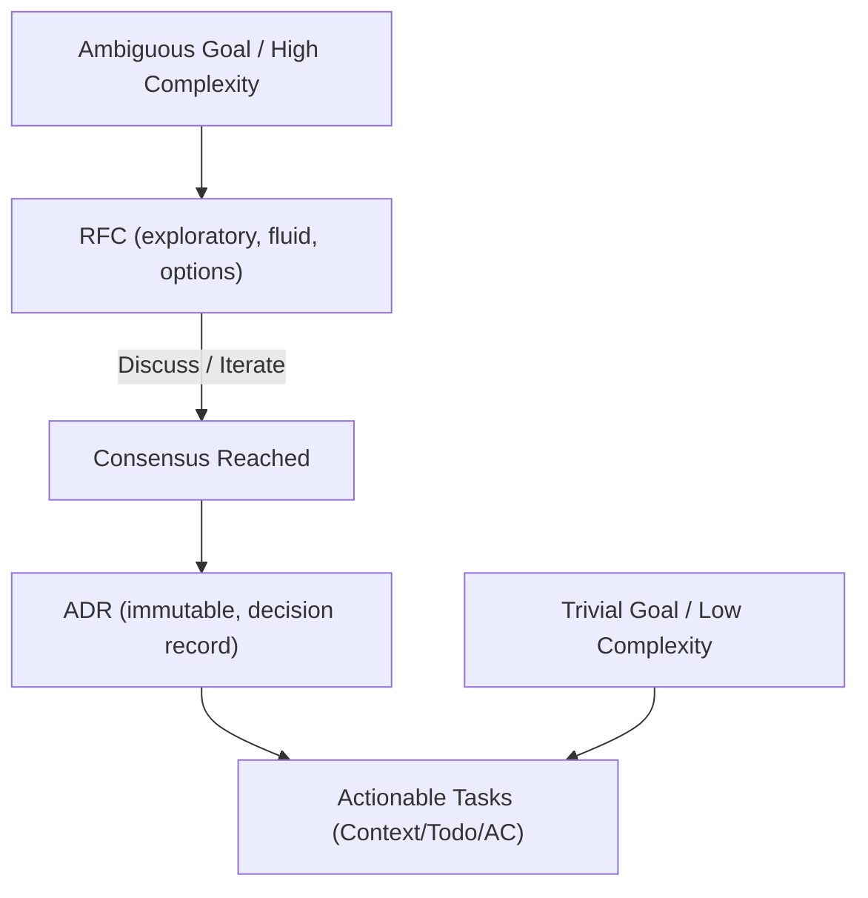

# Codebase Engineering Workflow Standards

This skill establishes the core engineering standards, decision frameworks, and research rules for developing the **GoDoctor** codebase. It defines how we prioritize tasks, structure technical decisions, and systematically eliminate uncertainty via grounded research to guarantee the delivery of maximum business value with zero-defect quality.

---

## 1. The Prime Directive: Delivery of Business Value

The ultimate goal of all software engineering is the **delivery of business value**. We do not write code for the sake of coding ("vibe coding" without structure); we write code to solve real-world problems. 

To maximize effectiveness, we must:
- Keep changes small and focused.
- Eliminate overengineering.
- Maintain thin, vertical slices of functionality.
- Ensure every change has a clear path to production verification.

---

## 2. Planning & Technical Decision Pipeline

To manage the evolution of the codebase, we use a structured, conversational planning process:



- **RFC (Request for Comments):** Use when the problem is ambiguous, has high technical uncertainty, or requires design feedback. RFCs live in `design/rfc/`.
- **ADR (Architecture Decision Record):** Use to permanently record a concrete architectural decision. ADRs are immutable logs of the project's state. ADRs live in `design/adr/`.

---

## 3. Prioritization Process: The 2x2 Matrix

Before beginning any work, prioritize goals using the **2x2 Prioritization Matrix**, which maps tasks based on their **Business Value** and **Technical Certainty**:

| | **High Technical Certainty** | **Low Technical Certainty** |
| :--- | :--- | :--- |
| **High Business Value** | **Synchronous (Hands-on):**<br>Execute immediately using high-control interactive tools. Stay "in the loop" to maintain absolute control. | **Asynchronous Research & Spikes:**<br>Do NOT write production code yet. You must run research, build prototypes, or draft an **RFC** to reduce uncertainty first. |
| **Low Business Value** | **Asynchronous Delegation:**<br>Delegate these "nice-to-have" tasks to background coding agents or subagents to free up principal developer time. | **Avoid or Defer:**<br>Do not spend time here. If absolutely necessary, delegate to background agents for low-priority execution *after* attempting to increase certainty. |

---

## 4. Technical Uncertainty Reduction (The Research Process)

When facing a **Low Technical Certainty** task, you must systematically reduce uncertainty *before* writing any production code:

1. **Build a "Spike" (Prototype):** Create a temporary, throwaway implementation in the `scratch/` directory to test APIs, libraries, and compiler compatibility.
2. **Grounded Research:** Gather facts using the **7-tier Evidence Hierarchy** to prevent version hallucinations and verify compatibility.
3. **Source Citation Requirement (CRITICAL):** When presenting research findings, you **MUST always include direct, clickable HTTP links** to the exact source documentation, blog posts, or repositories. Never state a fact about a third-party API or package without providing its source URL.

---

## 5. The 7-Tier Evidence Hierarchy (NEVER GUESS)

To bypass AI model training cutoff limits and prevent library API hallucinations, all technical research must be grounded on verified evidence. Use the following hierarchy of source validity, prioritizing stronger evidence over weaker ones:

```text
[1] SOURCE CODE (Strongest)
  └── [2] OFFICIAL DOCUMENTATION
        └── [3] OFFICIAL PRODUCT BLOGS
              └── [4] LEADER BLOG POSTS (<3 Months)
                    └── [5] REPUTABLE COMMUNITY POSTS (<3 Months)
                          └── [6] BLOGS (>3 Months)
                                └── [7] SOCIAL MEDIA (Weakest)
```

1. **Source Code (Strongest Evidence):** Reading the actual source files, package declarations, and dependency codebases. This is the absolute truth when dealing with dependency uncertainties.
2. **Official Documentation:** Authoritative manuals, API specs, and package docs (e.g., pkg.go.dev).
3. **Official Blog Posts:** Product owner announcements (e.g., go.dev/blog, company website).
4. **Professional Blog Posts from Industry Leaders:** Posts by reputable leaders (e.g., Martin Fowler, danicat) and recognized professionals (e.g., developer relations engineers) **dated less than 3 months old** (unless the content is evergreen).
5. **Reputable Community Blog Posts:** Dated **less than 3 months old** in reputable publications (e.g., Medium, dev.to).
6. **Blog Posts Older Than 3 Months:** Dangerous. Technologies and APIs evolve rapidly; older posts frequently reference obsolete patterns or deprecated packages.
7. **Social Media (Weakest Evidence):** High risk of hype, lack of peer review, and outdated or transient facts. Use only as a starting point to find links to official sources.

---

## 6. Real-Time Version Verification & Model Drift Management

AI models operate under static training data cutoff limits. This introduces **Model Drift**, where the model incorrectly assumes modern software packages, library versions, or even newer LLM models (e.g., assuming `gemini-3.5-flash` does not exist or that `gemini-2.5-pro` is the latest) do not exist.

To mitigate this limitation, you must follow this mandatory version verification protocol:

### The Real-Time Truth Gate
- **Never Assume Versions:** Never hardcode or propose a software dependency or LLM model name based solely on your internal weights.
- **Use Real-Time Skills:** Whenever adding a dependency, configuring an API, or referencing an LLM model, you **MUST actively trigger and consult** real-time verification skills such as `latest-software-versions` or `latest-version`.
- **Query Live Registries:** Utilize standard package registry queries (e.g., `go list -m -versions`, npm queries, or proxy lookups) to bypass the cutoff limits and verify the absolute latest stable releases.

---

## 7. Safe Release Protocol

As the final stage of any technical milestone, refactoring, or feature branch completion, you must respect the strict release quality gate before interacting with the Git repository for committing, tagging, or publishing.

### The Immutable Git Boundary
- **Pre-Release Checklist Trigger:** Before staging files or performing any Git commit, push, or release action, you **MUST actively consult and completely execute** the **`ready-for-release-check`** skill.
- **Zero-Bypass Policy:** Under no circumstances are you permitted to interact with the Git repository if any points on the 14-point pre-release quality gate (compilation, test runs, linter checks, regressions, version syncs, security reviews, and leak scans) remain unverified.
